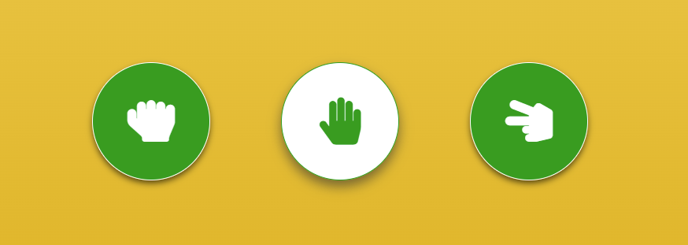

# Rock Paper Scissors

## Live Site

[Rock Paper Scissors Game](https://gjularic.github.io/rock-paper-scissors/)

## Repository

[https://github.com/gjularic/rock-paper-scissors](https://github.com/gjularic/rock-paper-scissors)

---

## Objective

Design an Rock Paper Scissors game which should
demonstrate competency with JavaScript, HTML and CSS.

---

## Features

### Existing Features

- Site features the score section. When User or Computer wins the score will automatically increment.   
When it reaches 10 on either side it will show to the user if they won or lost the game.  
 

  
 

- In the middle we have the User choice section. User will pick one of the options which will trigger the function to generate random computer choice  
 

  
 

- At the bottom of the page there's a section that initially serves as rules section.  
When the first pick has been made by the user it will change and display the outcome of the round from that point onward.  
 

  
 

- In the end we have the conclusion of the whole game when the score reaches 10 points on either side,  
and this page shows up for the user to see if the won or lost and if they want to restart the game.  
If "Play Again" button has been pressed whole page will be reloaded and so we have the main page again  
where the score has been reset.  
 

  
 

### Features Left to Implement  

- Delay and highlight animation of the computer generated choice
- Highlight animation when the score changes
- Add some sounds for each action on the site  
 

## Technologies Used

- *[JavaScript](https://developer.mozilla.org/en-US/docs/Web/JavaScript)*
- *[HTML](https://developer.mozilla.org/en-US/docs/Web/HTML)*
- *[CSS](https://developer.mozilla.org/en-US/docs/Web/CSS)*
- *[Font Awesome](https://fontawesome.com/)*
- *[Google Fonts](https://fonts.google.com/)*
- *[Chrome DevTools](https://developer.chrome.com/docs/devtools/)*
- *[W3C Markup Validation Service](https://validator.w3.org)*
- *[CSS Validator](https://jigsaw.w3.org/css-validator)*
- *[JSHint](https://jshint.com/)*
- *[Multi Device Mockup Generator](https://websitemockupgenerator.com/)*

---

## Testing

- All the functions of the site have been tested and work properly. 
- Incrementing of the scores, checking for the player choice and generating computer choice,
  changing the result text depending on who wins and restart page all work as intended.
- Site has been tested on most of the different devices and works great on all of them
- Tested in Google Chrome, Mozilla Firefox, Edge and Opera browsers

---

### W3C Validator

#### HTML

- No issues found in the HTML file  

---

#### CSS

- No errors found in CSS file  

---

### JSHint

- 1 error found by JSHint:
"Functions declared within loops referencing an outer scoped variable may lead to confusing semantics. (playerOption, compRandomOption, gameResult, restartGame)"

### Lighthouse
- Lighthouse desktop test  

- Lighthouse mobile test  

---

## Bugs

### Current  

- Color scheme is off if the browser has night mode active

---

### Resolved  

- There were no major bugs, just minor typos in syntax

## Deployment

Website was deployed via Github:

- Browse to the correct repository while logged in
- Click on "Settings" located on the top
- Scroll down and open GitHub Pages section
- In the dropdown for the branch select "Main" and "Save"

The live link can be found here - https://gjularic.github.io/rock-paper-scissors/

## Credits 

### Content 

- Used [Stack Overflow](https://stackoverflow.com/), [w3schools](https://www.w3schools.com/) and Code Institute course exercises to remind myself of some basic JavaScript concepts.

### Media

- Font Awsome for the User choice icons